# DOSW_ParcialT1_PedroAyala

### 1. diagrama de contexto
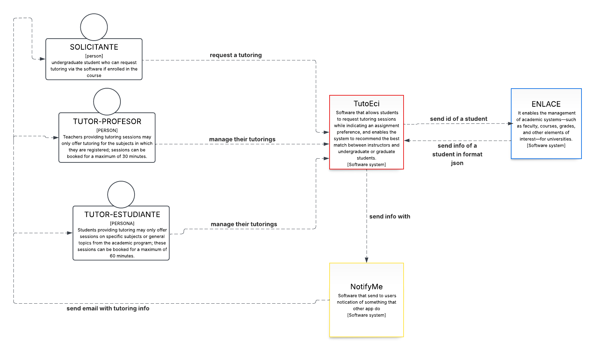

### 2. requerimientos

funcionales:

1. el sistema debe notificar a los estudiantes antes de sus tutorias

2. el sistema debe poder permitir discriminar entre tutores profesores y estudiantes

3. el sistema debe permitir que al momento de generar una reserva darle  un tiempo determinado y cambiar la dinamica dependiendo en ambos casos si es profesor o estudiante apartir de una opcion que el estudiante haya escogido (FASTEST_AVAILABLE,EXPERT_FIRST,PEER_TUTORING)

no funcionales

1. debe poner adapatarse entre dispositivos celulares y de escritorio

2. debe tener los colores de la universidad y debe cumplir los estandares minimos de WCAG 2.1 Nivel AA

| Campo | Descripción |
|------|-------------|
| **ID** | RF-02 |
| **Nombre del requerimiento** | DISCRIMINACION DE TUTORES |
| **Descripción** | El sistema debe tener un organizador (una posible base de datos) que discrimine o sepa quienes son los tutores y que tipo de tutores son si son profesores o estudiantes. |
| **Precondiciones** | Para que el sistema cumpla con este requerimiento, previamente ya se debio diseñar una base de datos e implementarla ademas deberia estar alojada en un servidor y estar conectada mediante una api al servidor|
| **Actor** | sistema  |
| **Flujo principal** | 1. el sistema desea saber si el tutor es profesor o estuidante y le pregunta a su organizador. 2. el organizador con la información dada por el sistema debe realizar una consulta a su base de datos 3. el organizador retorna la información al sistema  4.  el sistema hara uso de dicha información. |
| **Diagrama de caso de uso** | 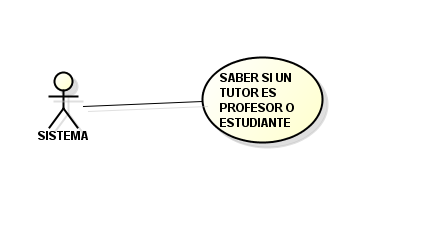 |
| **Poscondiciones** | Se espera como resultado que la reserva se haya creado actualizando el calendario y horario del profesor y estudiante. |

| Campo | Descripción |
|------|-------------|
| **ID** | RF-03 |
| **Nombre del requerimiento** | GENERACION DE RESERVA |
| **Descripción** | El sistema debe poder al momento de generar una reserva asignarle automaticamente un tiempo maximo dependiendo de si el tutor es profesor o estudiante ademas de cambiar la dinamica d ela tutoria ya que si es estudiante puede explicar no solo materias en especifico sino tambien de temas generales del programa academico . |
| **Precondiciones** | Para que el sistema cumpla con este requerimiento, TutoECI debe tener previamente un organizador que peuda discriminar entre profesores y estudiantes y con sus respetivos permisos activos |
| **Actor** | solicitante  |
| **Flujo principal** | 1. El solicitante inicia sesión en el sistema con sus credenciales. 2. el sistema verifica mandandole a enlace el id del estudiante para ver si puede recibir esa tutoria, en caso de que no aqui acabaria el flujo (FASTEST_AVAILABLE,EXPERT_FIRST,PEER_TUTORING). 3. El solicitante solicita una tutoria entre 3 opciones  4.  El organizador debe descriminar dependiendo de la opcion que el estudiante haya escogido y asignarle un tutor. 6. el sistema ya con el tutor asignado debe poder crearle una reserva al estudiante y al profesor  7. El sistema notifica a ambos de que se genero una reserva. |
| **Diagrama de caso de uso** | 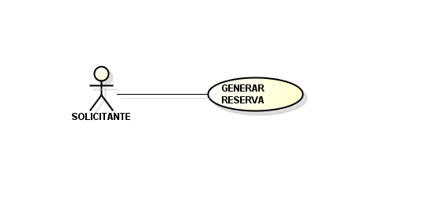 |
| **Poscondiciones** | Se espera como resultado que la reserva se haya creado actualizando el calendario y horario del profesor y estudiante. |

| Campo | Descripción |
|------|-------------|
| **ID** | HU-01 |
| **Título** | Solicitud de diferencia entre profesores y estudiantes |
| **Descripción** | *Como SISTEMA, quiero saber si un tutor es profesor o estudiante, para poder crear corretamente una reserva .* |
| **Criterios de aceptación** | 1. Dado que el sistema envio una informacion de un profesor el organizador le debe devoler correctamente si es profesor y que materias da 2. Dado que el sistema da una informamación de un estudiante el organizador le retorna correctamente la información del estudiante que materias puede dar y que tema generales tambien da. 3. Dado que el sistema ingreso un tutor inexsistente el organizador le debe notificar que dicho tutor no existe. |
| **Prioridad** | *Alta* |
| **Estimación** | *5 puntos de historia* |

| Campo | Descripción |
|------|-------------|
| **ID** | HU-02 |
| **Título** | generación de una reserva apartir de los solicitado por un solicitante |
| **Descripción** | *Como SOLICITANTE, quiero generar una reserva con algun tipo de condicion (FASTEST_AVAILABLE,EXPERT_FIRST,PEER_TUTORING), para poder recibir una tutoria dependiendo de las necesidades mias y mis preferencai respecto a temas de estudio.* |
| **Criterios de aceptación** | 1. Dado que el estudiante escogio la opcion FASTEST_AVAILABLE le genera una reserva con el tutor libre mas proximo, pueden ser tutorias de una hora o media hora 2. Dado que el estudiante escogio la opcion ,EXPERT_FIRST le buscara entre los tutores profesores libres mas proximos y si no hay se buscara con los tutores estudiantes pueden pueden ser tutorias de una hora o media hora. 3.Dado que el estudiante escogio la opcion PEER_TUTORING buscara los tutores estudiantes libres mas proximos y generara una reserva solo de media hora. |
| **Prioridad** | *Alta* |
| **Estimación** | *8 puntos de historia* |

### 3 Planeación Agile

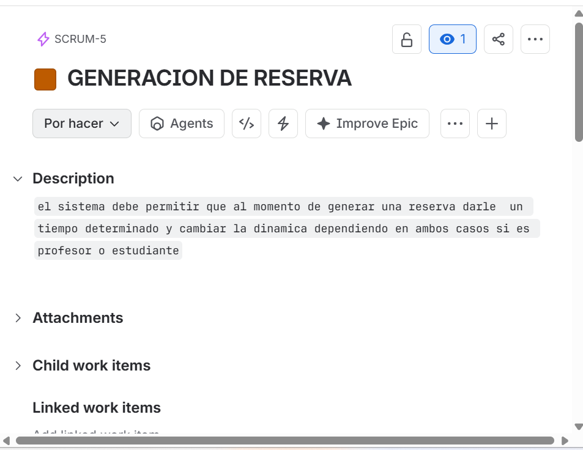 
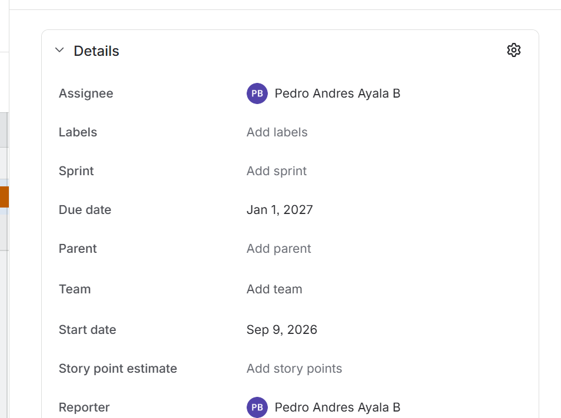 
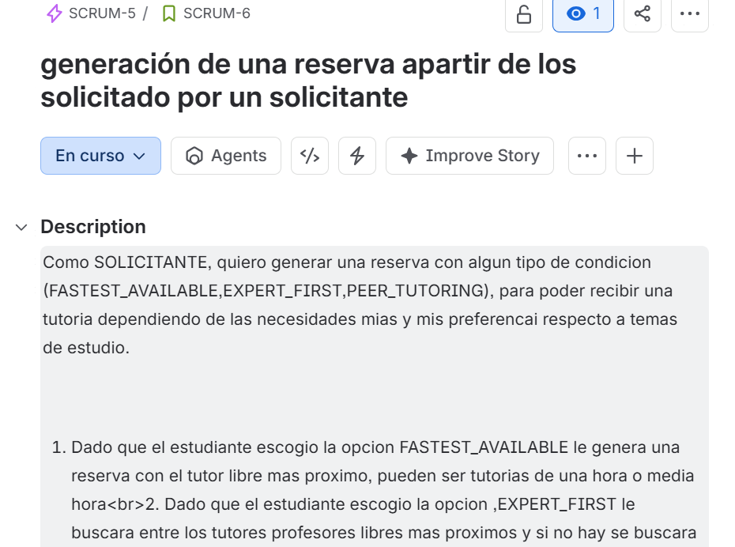 
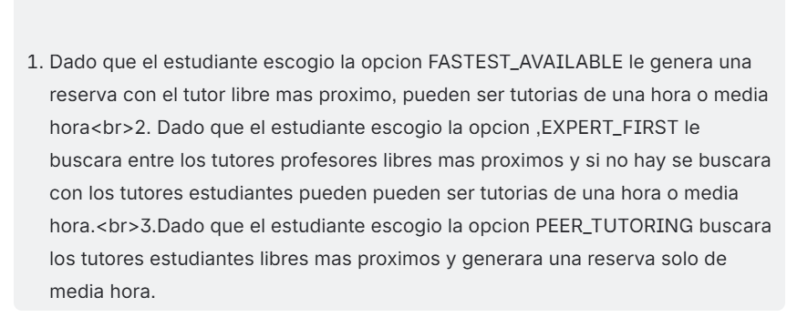 
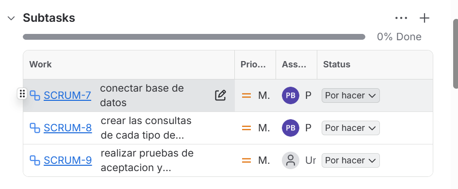 
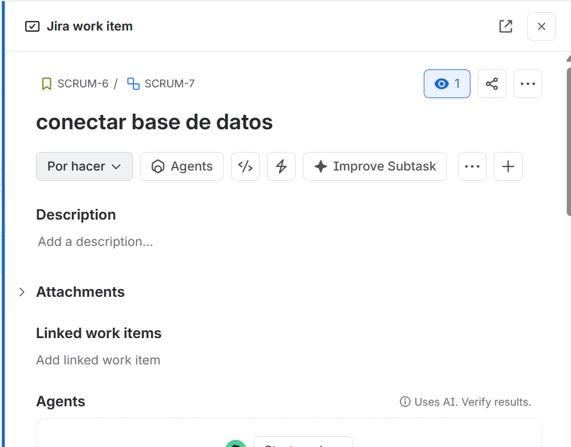 
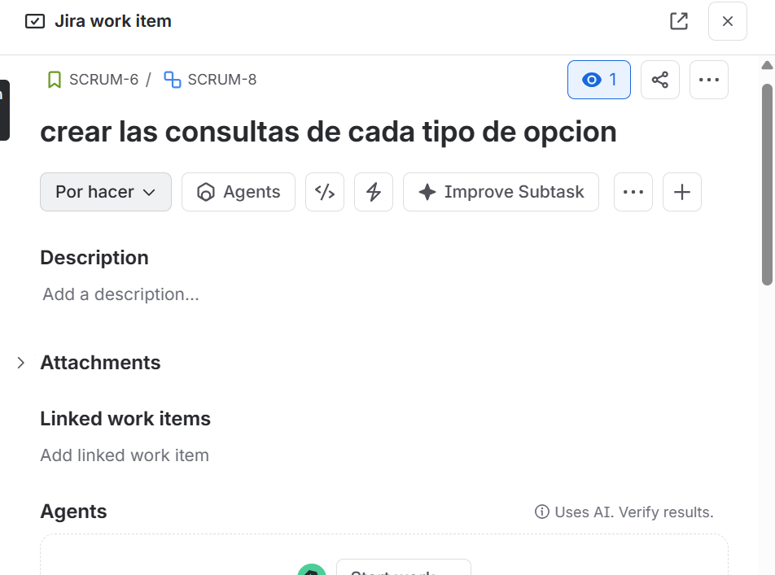 
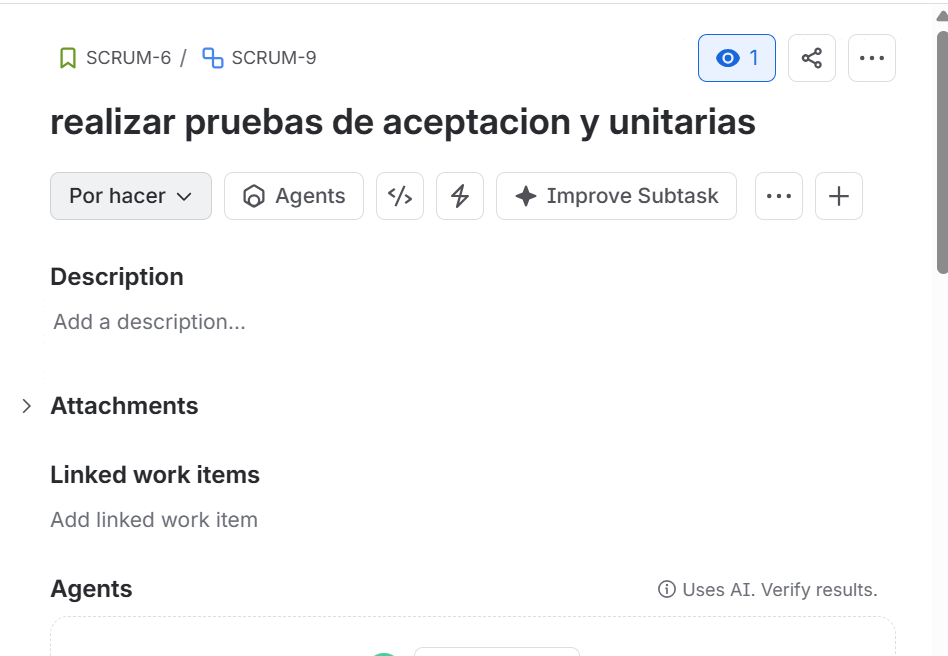

*link de jira* https://mail-team-lsxe118t.atlassian.net/?continue=https%3A%2F%2Fmail-team-lsxe118t.atlassian.net%2Fwelcome%2Fsoftware%3FprojectId%3D10000&atlOrigin=eyJpIjoiYmEzZTdiNjVhMmVmNDY2ZTk2MzQ4MjcwMzU3YzY0YjciLCJwIjoiamlyYS1zb2Z0d2FyZSJ9

https://mail-team-lsxe118t.atlassian.net/jira/software/projects/SCRUM/boards/1/backlog?selectedIssue=SCRUM-9

### 4 Diseño de Software y 

primero vamos a escoger el patron para poder escoger correctamente la opcion que quiere el estudiante para su tutoria
| Item | Team Explanation |
|---|---|
| **Design Pattern Category** | comportamineto |
| **Pattern Used** | command pattern |
| **Justification** | se va a usar estre patron ya que nos permite convertir una solicitud en un objeto independiente que contiene toda la información sobre la solicitud en este caso las solictudes seran 3 distintas FASTEST_AVAILABLE,EXPERT_FIRST,PEER_TUTORING estas tres generan un comportamineto distinto al momento de crear la reserva. |
| **How It Was Applied** |  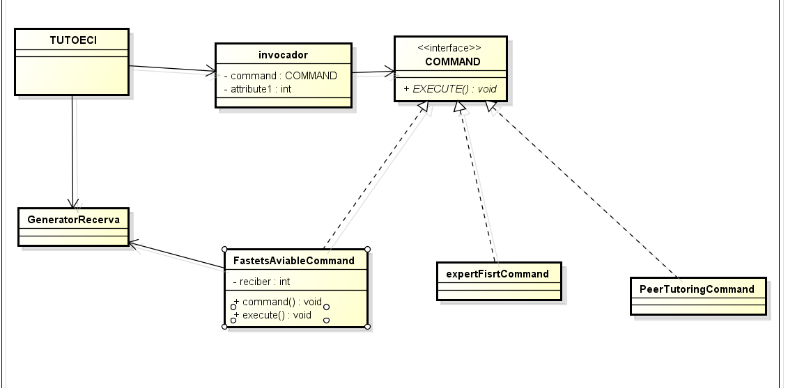|

